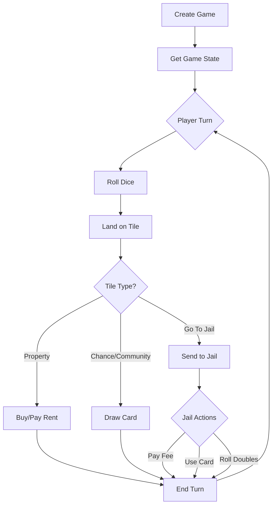
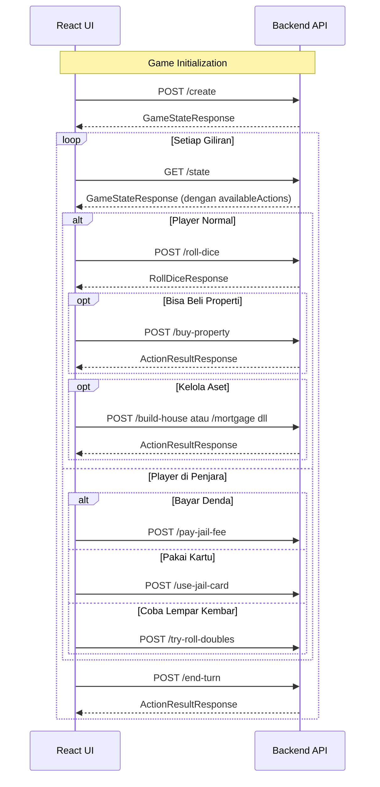

# 🎲 Monopoly Backend API Documentation

> Dokumentasi komprehensif untuk pengembangan frontend React JS game Monopoly

## 📋 Daftar Isi

- [Overview](#overview)
- [Setup & Configuration](#setup--configuration)
- [API Endpoints](#api-endpoints)
- [Data Types (TypeScript)](#data-types-typescript)
- [Game Flow](#game-flow)
- [React Integration Guide](#react-integration-guide)

---

## Overview

### Tech Stack Backend
| Komponen | Teknologi |
|----------|-----------|
| Framework | ASP.NET Core (C#) |
| API Type | REST API |
| CORS | Enabled untuk `localhost:3000` dan `localhost:5173` |
| Dokumentasi | Swagger UI (Development mode) |

### Base URL
```
http://localhost:5000/api/game
```

### Game Flow Summary


---

## Setup & Configuration

### Backend Configuration
```json
// appsettings.json
{
  "Logging": {
    "LogLevel": {
      "Default": "Information"
    }
  },
  "AllowedHosts": "*"
}
```

### CORS Configuration (sudah dikonfigurasi)
```csharp
// Program.cs - React app sudah di-whitelist
policy.WithOrigins(
    "http://localhost:3000",  // Create React App
    "http://localhost:5173"   // Vite
)
```

### Running Backend
```bash
cd backend-monopoly
dotnet run
```
Backend akan tersedia di:
- API: `http://localhost:5000` atau `https://localhost:5001`
- Swagger UI: `http://localhost:5000/swagger`

---

## API Endpoints

### 🎮 Game Management

#### 1. Create Game
Membuat game baru dengan 2-4 pemain.

| Property | Value |
|----------|-------|
| **Method** | `POST` |
| **Endpoint** | `/api/game/create` |

**Request Body:**
```json
{
  "playerNames": ["Player1", "Player2", "Player3"]
}
```

**Success Response (200):**
```json
{
  "isGameStarted": true,
  "isGameOver": false,
  "winnerName": null,
  "currentTurn": 0,
  "currentPlayerName": "Player1",
  "availableActions": ["roll-dice", "end-turn"],
  "players": [
    {
      "name": "Player1",
      "position": 0,
      "currentTileName": "GO",
      "currentTileType": "Corner",
      "money": 1500,
      "state": "Normal",
      "properties": [],
      "jailTurns": 0,
      "hasGetOutOfJailCard": false
    }
  ],
  "allProperties": [
    {
      "name": "Mediterranean Avenue",
      "type": "RealEstate",
      "value": 60,
      "ownerName": null,
      "houses": 0,
      "isMortgaged": false,
      "rent": 0
    }
  ]
}
```

**Error Response (400):**
```json
{ "error": "Must have 2-4 players" }
```

**Error Response (409):**
```json
{ "error": "Game already exists. Reset first." }
```

---

#### 2. Reset Game
Menghapus game yang sedang berjalan.

| Property | Value |
|----------|-------|
| **Method** | `POST` |
| **Endpoint** | `/api/game/reset` |

**Success Response (200):**
```json
{ "message": "Game reset successfully" }
```

---

#### 3. Get Game Status
Mengecek apakah ada game aktif.

| Property | Value |
|----------|-------|
| **Method** | `GET` |
| **Endpoint** | `/api/game/status` |

**Response (200):**
```json
{ "hasActiveGame": true }
```

---

#### 4. Get Board Configuration
Mendapatkan konfigurasi papan untuk rendering.

| Property | Value |
|----------|-------|
| **Method** | `GET` |
| **Endpoint** | `/api/game/board` |

**Response (200):**
```json
{
  "tiles": [
    {
      "position": 0,
      "name": "GO",
      "type": "Corner",
      "effect": "Go",
      "price": null,
      "assetType": null
    },
    {
      "position": 1,
      "name": "Mediterranean Avenue",
      "type": "Property",
      "effect": "Nothing",
      "price": 60,
      "assetType": "RealEstate"
    }
  ],
  "totalTiles": 40
}
```

---

#### 5. Get Game State
Mendapatkan state game lengkap.

| Property | Value |
|----------|-------|
| **Method** | `GET` |
| **Endpoint** | `/api/game/state` |

**Response (200):** Sama seperti response Create Game

**Error (404):**
```json
{ "error": "No active game. Create one first." }
```

---

### 🎲 Player Actions

#### 6. Roll Dice
Lempar dadu dan pindah posisi.

| Property | Value |
|----------|-------|
| **Method** | `POST` |
| **Endpoint** | `/api/game/roll-dice` |

**Request Body:**
```json
{ "playerName": "Player1" }
```

**Success Response (200):**
```json
{
  "dice1": 4,
  "dice2": 3,
  "total": 7,
  "isDouble": false,
  "newPosition": 7,
  "landedTile": "Chance"
}
```

**Error (400):**
```json
{ "error": "It's not Player1's turn. Current player is Player2." }
```

---

#### 7. Buy Property
Membeli properti di tile saat ini.

| Property | Value |
|----------|-------|
| **Method** | `POST` |
| **Endpoint** | `/api/game/buy-property` |

**Request Body:**
```json
{ "playerName": "Player1" }
```

**Success Response (200):**
```json
{
  "success": true,
  "message": "Successfully bought Mediterranean Avenue"
}
```

**Error (400):**
```json
{ "error": "Player1 tidak punya cukup uang untuk membeli Mediterranean Avenue." }
```

---

#### 8. Build House
Membangun rumah di properti.

| Property | Value |
|----------|-------|
| **Method** | `POST` |
| **Endpoint** | `/api/game/build-house` |

**Request Body:**
```json
{
  "playerName": "Player1",
  "propertyName": "Mediterranean Avenue"
}
```

**Success Response (200):**
```json
{
  "success": true,
  "message": "Built house on Mediterranean Avenue"
}
```

**Error (400):**
```json
{ "error": "Maksimum rumah (hotel) sudah dibangun." }
```

---

#### 9. Sell House
Menjual rumah di properti.

| Property | Value |
|----------|-------|
| **Method** | `POST` |
| **Endpoint** | `/api/game/sell-house` |

**Request Body:**
```json
{
  "playerName": "Player1",
  "propertyName": "Mediterranean Avenue"
}
```

**Success Response (200):**
```json
{
  "success": true,
  "message": "Sold house on Mediterranean Avenue"
}
```

---

#### 10. Mortgage Property
Menggadaikan properti untuk mendapat uang.

| Property | Value |
|----------|-------|
| **Method** | `POST` |
| **Endpoint** | `/api/game/mortgage` |

**Request Body:**
```json
{
  "playerName": "Player1",
  "propertyName": "Mediterranean Avenue"
}
```

**Success Response (200):**
```json
{
  "success": true,
  "message": "Mortgaged Mediterranean Avenue"
}
```

**Error (400):**
```json
{ "error": "Must sell all houses before mortgaging." }
```

---

#### 11. Unmortgage Property
Menebus properti yang digadaikan.

| Property | Value |
|----------|-------|
| **Method** | `POST` |
| **Endpoint** | `/api/game/unmortgage` |

**Request Body:**
```json
{
  "playerName": "Player1",
  "propertyName": "Mediterranean Avenue"
}
```

**Success Response (200):**
```json
{
  "success": true,
  "message": "Unmortgaged Mediterranean Avenue"
}
```

---

#### 12. Trade
Menukar properti dan uang antar pemain.

| Property | Value |
|----------|-------|
| **Method** | `POST` |
| **Endpoint** | `/api/game/trade` |

**Request Body:**
```json
{
  "playerName": "Player1",
  "targetPlayerName": "Player2",
  "offeredProperties": ["Mediterranean Avenue"],
  "offeredMoney": 50,
  "requestedProperties": ["Baltic Avenue"],
  "requestedMoney": 0
}
```

**Success Response (200):**
```json
{
  "success": true,
  "message": "Trade completed successfully"
}
```

---

### 🔒 Jail Actions

#### 13. Pay Jail Fee
Membayar $50 untuk keluar dari penjara.

| Property | Value |
|----------|-------|
| **Method** | `POST` |
| **Endpoint** | `/api/game/pay-jail-fee` |

**Request Body:**
```json
{ "playerName": "Player1" }
```

**Success Response (200):**
```json
{
  "success": true,
  "message": "Paid jail fee and released"
}
```

---

#### 14. Use Jail Card
Menggunakan kartu "Get Out of Jail Free".

| Property | Value |
|----------|-------|
| **Method** | `POST` |
| **Endpoint** | `/api/game/use-jail-card` |

**Request Body:**
```json
{ "playerName": "Player1" }
```

**Success Response (200):**
```json
{
  "success": true,
  "message": "Used Get Out of Jail card"
}
```

---

#### 15. Try Roll Doubles
Mencoba lempar dadu kembar untuk keluar dari penjara.

| Property | Value |
|----------|-------|
| **Method** | `POST` |
| **Endpoint** | `/api/game/try-roll-doubles` |

**Request Body:**
```json
{ "playerName": "Player1" }
```

**Success Response (200):**
```json
{
  "dice1": 3,
  "dice2": 3,
  "total": 6,
  "isDouble": true,
  "newPosition": 16,
  "landedTile": "St. James Place"
}
```

---

#### 16. End Turn
Mengakhiri giliran dan pindah ke pemain selanjutnya.

| Property | Value |
|----------|-------|
| **Method** | `POST` |
| **Endpoint** | `/api/game/end-turn` |

**Request Body:**
```json
{ "playerName": "Player1" }
```

**Success Response (200):**
```json
{
  "success": true,
  "message": "Turn ended. Now it's Player2's turn."
}
```

---

## Data Types (TypeScript)

### Request Types

```typescript
// Membuat game baru
interface CreateGameRequest {
  playerNames: string[]; // 2-4 nama pemain unik
}

// Aksi pemain dasar
interface PlayerActionRequest {
  playerName: string;
}

// Build/Sell house & Mortgage
interface PropertyActionRequest extends PlayerActionRequest {
  propertyName: string;
}

// Trade antar pemain
interface TradeRequest extends PlayerActionRequest {
  targetPlayerName: string;
  offeredProperties: string[];
  offeredMoney: number;
  requestedProperties: string[];
  requestedMoney: number;
}
```

### Response Types

```typescript
// Status game lengkap
interface GameStateResponse {
  isGameStarted: boolean;
  isGameOver: boolean;
  winnerName: string | null;
  currentTurn: number;
  currentPlayerName: string;
  availableActions: AvailableAction[];
  players: PlayerResponse[];
  allProperties: PropertyResponse[];
}

// Data pemain
interface PlayerResponse {
  name: string;
  position: number;           // 0-39 (index tile)
  currentTileName: string;
  currentTileType: TileType;
  money: number;
  state: PlayerState;
  properties: PropertyResponse[];
  jailTurns: number;
  hasGetOutOfJailCard: boolean;
}

// Data properti
interface PropertyResponse {
  name: string;
  type: AssetType;
  value: number;              // Harga beli
  ownerName: string | null;
  houses: number;             // 0-4 rumah, 5 = hotel
  isMortgaged: boolean;
  rent: number;
}

// Data tile (untuk render papan)
interface TileResponse {
  position: number;
  name: string;
  type: TileType;
  effect: EffectType;
  price: number | null;
  assetType: AssetType | null;
}

// Konfigurasi papan
interface BoardResponse {
  tiles: TileResponse[];
  totalTiles: number;         // 40
}

// Hasil lempar dadu
interface RollDiceResponse {
  dice1: number;              // 1-6
  dice2: number;              // 1-6
  total: number;              // 2-12
  isDouble: boolean;
  newPosition: number;        // 0-39
  landedTile: string;
}

// Hasil aksi umum
interface ActionResultResponse {
  success: boolean;
  message: string;
  data?: any;
}
```

### Enum Types

```typescript
// Status pemain
type PlayerState = 'Normal' | 'InJail' | 'Bankrupt';

// Tipe aset
type AssetType = 'RealEstate' | 'PublicService' | 'Railroad';

// Tipe tile
type TileType = 'Property' | 'Railroad' | 'Utility' | 'Corner' | 'Special';

// Efek tile
type EffectType = 
  | 'Go'              // Dapat $200 saat melewati
  | 'Nothing'         // Properti biasa
  | 'CommunityChest'  // Ambil kartu Community Chest
  | 'Chance'          // Ambil kartu Chance
  | 'Tax'             // Bayar pajak ($200 atau $100)
  | 'GoToJail'        // Langsung ke penjara
  | 'FreeParking';    // Tidak ada efek

// Aksi yang tersedia (dinamis berdasarkan state)
type AvailableAction =
  | 'roll-dice'
  | 'buy-property'
  | 'build-house'
  | 'sell-house'
  | 'mortgage-property'
  | 'unmortgage-property'
  | 'trade'
  | 'pay-jail-fee'
  | 'use-jail-card'
  | 'try-roll-doubles'
  | 'end-turn';
```

---

## Game Flow

### Turn Flow Diagram


### Game Rules

| Rule | Detail |
|------|--------|
| **Uang Awal** | $1500 per pemain |
| **Melewati GO** | +$200 |
| **Biaya Rumah** | 50% harga properti |
| **Harga Jual Rumah** | 25% harga properti |
| **Nilai Gadai** | 50% harga properti |
| **Biaya Tebus Gadai** | 110% nilai gadai |
| **Denda Penjara** | $50 |
| **Pajak Pendapatan** | $200 |
| **Pajak Mewah** | $100 |
| **Max Rumah** | 4 rumah + 1 hotel per properti |

### Rent Calculation

| Tipe Properti | Perhitungan Sewa |
|---------------|------------------|
| **RealEstate (tanpa rumah)** | 10% harga properti |
| **RealEstate + 1 rumah** | Base rent × 5 |
| **RealEstate + 2 rumah** | Base rent × 15 |
| **RealEstate + 3 rumah** | Base rent × 45 |
| **RealEstate + 4 rumah** | Base rent × 80 |
| **RealEstate + hotel** | Base rent × 100 |
| **Railroad (1)** | $25 |
| **Railroad (2)** | $50 |
| **Railroad (3)** | $100 |
| **Railroad (4)** | $200 |
| **Utility (1)** | $25 |
| **Utility (2)** | $50 |

---

## React Integration Guide

### Project Setup (Vite + React + TypeScript)

```bash
npx create-vite@latest monopoly-frontend --template react-ts
cd monopoly-frontend
npm install axios
npm run dev
```

### API Service Layer

```typescript
// src/services/api.ts
import axios from 'axios';
import type {
  CreateGameRequest,
  PlayerActionRequest,
  PropertyActionRequest,
  TradeRequest,
  GameStateResponse,
  BoardResponse,
  RollDiceResponse,
  ActionResultResponse,
} from '../types';

const api = axios.create({
  baseURL: 'http://localhost:5000/api/game',
  headers: { 'Content-Type': 'application/json' },
});

export const gameApi = {
  // Game Management
  createGame: (data: CreateGameRequest) =>
    api.post<GameStateResponse>('/create', data),
  
  resetGame: () =>
    api.post<{ message: string }>('/reset'),
  
  getStatus: () =>
    api.get<{ hasActiveGame: boolean }>('/status'),
  
  getBoard: () =>
    api.get<BoardResponse>('/board'),
  
  getState: () =>
    api.get<GameStateResponse>('/state'),

  // Player Actions
  rollDice: (playerName: string) =>
    api.post<RollDiceResponse>('/roll-dice', { playerName }),
  
  buyProperty: (playerName: string) =>
    api.post<ActionResultResponse>('/buy-property', { playerName }),
  
  buildHouse: (data: PropertyActionRequest) =>
    api.post<ActionResultResponse>('/build-house', data),
  
  sellHouse: (data: PropertyActionRequest) =>
    api.post<ActionResultResponse>('/sell-house', data),
  
  mortgage: (data: PropertyActionRequest) =>
    api.post<ActionResultResponse>('/mortgage', data),
  
  unmortgage: (data: PropertyActionRequest) =>
    api.post<ActionResultResponse>('/unmortgage', data),
  
  trade: (data: TradeRequest) =>
    api.post<ActionResultResponse>('/trade', data),

  // Jail Actions
  payJailFee: (playerName: string) =>
    api.post<ActionResultResponse>('/pay-jail-fee', { playerName }),
  
  useJailCard: (playerName: string) =>
    api.post<ActionResultResponse>('/use-jail-card', { playerName }),
  
  tryRollDoubles: (playerName: string) =>
    api.post<RollDiceResponse>('/try-roll-doubles', { playerName }),
  
  endTurn: (playerName: string) =>
    api.post<ActionResultResponse>('/end-turn', { playerName }),
};
```

### Custom Hook untuk Game State

```typescript
// src/hooks/useGameState.ts
import { useState, useEffect, useCallback } from 'react';
import { gameApi } from '../services/api';
import type { GameStateResponse, BoardResponse } from '../types';

export function useGameState() {
  const [gameState, setGameState] = useState<GameStateResponse | null>(null);
  const [board, setBoard] = useState<BoardResponse | null>(null);
  const [loading, setLoading] = useState(false);
  const [error, setError] = useState<string | null>(null);

  // Fetch board configuration (statis)
  useEffect(() => {
    gameApi.getBoard()
      .then(res => setBoard(res.data))
      .catch(err => console.error('Failed to load board:', err));
  }, []);

  // Refresh game state
  const refreshState = useCallback(async () => {
    try {
      setLoading(true);
      const res = await gameApi.getState();
      setGameState(res.data);
      setError(null);
    } catch (err: any) {
      setError(err.response?.data?.error || 'Failed to fetch game state');
    } finally {
      setLoading(false);
    }
  }, []);

  // Action wrapper dengan auto-refresh
  const executeAction = useCallback(async <T>(
    action: () => Promise<T>
  ): Promise<T> => {
    try {
      setLoading(true);
      const result = await action();
      await refreshState();
      return result;
    } catch (err: any) {
      setError(err.response?.data?.error || 'Action failed');
      throw err;
    } finally {
      setLoading(false);
    }
  }, [refreshState]);

  return {
    gameState,
    board,
    loading,
    error,
    refreshState,
    executeAction,
  };
}
```

### Component State Management Pattern

```typescript
// src/components/GameBoard.tsx
import { useGameState } from '../hooks/useGameState';
import { gameApi } from '../services/api';

export function GameBoard() {
  const { gameState, board, loading, executeAction } = useGameState();

  const handleRollDice = async () => {
    if (!gameState) return;
    
    await executeAction(() => 
      gameApi.rollDice(gameState.currentPlayerName)
    );
  };

  const handleBuyProperty = async () => {
    if (!gameState) return;
    
    await executeAction(() => 
      gameApi.buyProperty(gameState.currentPlayerName)
    );
  };

  const handleEndTurn = async () => {
    if (!gameState) return;
    
    await executeAction(() => 
      gameApi.endTurn(gameState.currentPlayerName)
    );
  };

  // Render berdasarkan availableActions
  const canRollDice = gameState?.availableActions.includes('roll-dice');
  const canBuyProperty = gameState?.availableActions.includes('buy-property');

  return (
    <div>
      {/* Board rendering using board.tiles */}
      {/* Player tokens using gameState.players */}
      {/* Action buttons berdasarkan availableActions */}
      
      {canRollDice && (
        <button onClick={handleRollDice} disabled={loading}>
          Roll Dice
        </button>
      )}
      
      {canBuyProperty && (
        <button onClick={handleBuyProperty} disabled={loading}>
          Buy Property
        </button>
      )}
      
      <button onClick={handleEndTurn} disabled={loading}>
        End Turn
      </button>
    </div>
  );
}
```

### Recommended Folder Structure

```
monopoly-frontend/
├── src/
│   ├── components/
│   │   ├── Board/
│   │   │   ├── Board.tsx          # Papan utama
│   │   │   ├── Tile.tsx           # Komponen tile individu
│   │   │   └── PlayerToken.tsx    # Token pemain
│   │   ├── Player/
│   │   │   ├── PlayerCard.tsx     # Info pemain
│   │   │   ├── PropertyList.tsx   # Daftar properti
│   │   │   └── MoneyDisplay.tsx   # Tampilan uang
│   │   ├── Actions/
│   │   │   ├── ActionPanel.tsx    # Panel aksi
│   │   │   ├── DiceRoller.tsx     # Animasi dadu
│   │   │   ├── TradeModal.tsx     # Modal trading
│   │   │   └── JailOptions.tsx    # Opsi penjara
│   │   └── Game/
│   │       ├── GameSetup.tsx      # Form setup game
│   │       ├── GameOver.tsx       # Layar kemenangan
│   │       └── TurnIndicator.tsx  # Indikator giliran
│   ├── hooks/
│   │   ├── useGameState.ts
│   │   └── useGameActions.ts
│   ├── services/
│   │   └── api.ts
│   ├── types/
│   │   ├── index.ts               # Export semua types
│   │   ├── requests.ts
│   │   └── responses.ts
│   ├── utils/
│   │   ├── boardLayout.ts         # Posisi tile untuk CSS Grid
│   │   └── colorMapping.ts        # Warna properti
│   ├── App.tsx
│   └── main.tsx
└── package.json
```

---

## Board Layout Reference

### Tile Positions (40 tiles, index 0-39)

| Position | Name | Type | Price |
|----------|------|------|-------|
| 0 | GO | Corner | - |
| 1 | Mediterranean Avenue | RealEstate | $60 |
| 2 | Community Chest | Special | - |
| 3 | Baltic Avenue | RealEstate | $60 |
| 4 | Income Tax | Special | - |
| 5 | Reading Railroad | Railroad | $200 |
| 6 | Oriental Avenue | RealEstate | $100 |
| 7 | Chance | Special | - |
| 8 | Vermont Avenue | RealEstate | $100 |
| 9 | Connecticut Avenue | RealEstate | $120 |
| 10 | Jail / Just Visiting | Corner | - |
| 11 | St. Charles Place | RealEstate | $140 |
| 12 | Electric Company | Utility | $150 |
| 13 | States Avenue | RealEstate | $140 |
| 14 | Virginia Avenue | RealEstate | $160 |
| 15 | Pennsylvania Railroad | Railroad | $200 |
| 16 | St. James Place | RealEstate | $180 |
| 17 | Community Chest | Special | - |
| 18 | Tennessee Avenue | RealEstate | $180 |
| 19 | New York Avenue | RealEstate | $200 |
| 20 | Free Parking | Corner | - |
| 21 | Kentucky Avenue | RealEstate | $220 |
| 22 | Chance | Special | - |
| 23 | Indiana Avenue | RealEstate | $220 |
| 24 | Illinois Avenue | RealEstate | $240 |
| 25 | B&O Railroad | Railroad | $200 |
| 26 | Atlantic Avenue | RealEstate | $260 |
| 27 | Ventnor Avenue | RealEstate | $260 |
| 28 | Water Works | Utility | $150 |
| 29 | Marvin Gardens | RealEstate | $280 |
| 30 | Go To Jail | Corner | - |
| 31 | Pacific Avenue | RealEstate | $300 |
| 32 | North Carolina Avenue | RealEstate | $300 |
| 33 | Community Chest | Special | - |
| 34 | Pennsylvania Avenue | RealEstate | $320 |
| 35 | Short Line Railroad | Railroad | $200 |
| 36 | Chance | Special | - |
| 37 | Park Place | RealEstate | $350 |
| 38 | Luxury Tax | Special | - |
| 39 | Boardwalk | RealEstate | $400 |

### Property Color Groups

```typescript
const propertyColors: Record<string, string[]> = {
  brown: ['Mediterranean Avenue', 'Baltic Avenue'],
  lightBlue: ['Oriental Avenue', 'Vermont Avenue', 'Connecticut Avenue'],
  pink: ['St. Charles Place', 'States Avenue', 'Virginia Avenue'],
  orange: ['St. James Place', 'Tennessee Avenue', 'New York Avenue'],
  red: ['Kentucky Avenue', 'Indiana Avenue', 'Illinois Avenue'],
  yellow: ['Atlantic Avenue', 'Ventnor Avenue', 'Marvin Gardens'],
  green: ['Pacific Avenue', 'North Carolina Avenue', 'Pennsylvania Avenue'],
  darkBlue: ['Park Place', 'Boardwalk'],
};
```

---

## Error Handling

### Common Error Responses

| HTTP Code | Scenario | Response |
|-----------|----------|----------|
| 400 | Validation error | `{ "error": "message" }` |
| 404 | No active game | `{ "error": "No active game. Create one first." }` |
| 409 | Game exists | `{ "error": "Game already exists. Reset first." }` |

### React Error Handling Pattern

```typescript
// Centralized error handler
api.interceptors.response.use(
  (response) => response,
  (error) => {
    const message = error.response?.data?.error || 'An error occurred';
    
    // Show toast notification
    toast.error(message);
    
    return Promise.reject(error);
  }
);
```

---

## Testing Tips

### Test Endpoints dengan cURL

```bash
# Check status
curl http://localhost:5000/api/game/status

# Create game
curl -X POST http://localhost:5000/api/game/create \
  -H "Content-Type: application/json" \
  -d '{"playerNames": ["Alice", "Bob"]}'

# Get state
curl http://localhost:5000/api/game/state

# Roll dice
curl -X POST http://localhost:5000/api/game/roll-dice \
  -H "Content-Type: application/json" \
  -d '{"playerName": "Alice"}'

# End turn
curl -X POST http://localhost:5000/api/game/end-turn \
  -H "Content-Type: application/json" \
  -d '{"playerName": "Alice"}'

# Reset game
curl -X POST http://localhost:5000/api/game/reset
```

### Swagger UI
Akses `http://localhost:5000/swagger` untuk testing interaktif.

---

> 📝 **Note**: Dokumentasi ini dibuat berdasarkan analisis kode backend. Untuk update terbaru, lihat kode sumber di `Controllers/GameController.cs`.
